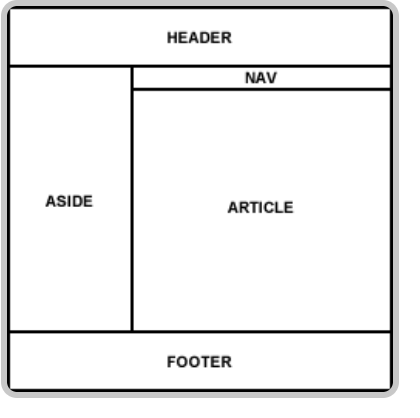

# dashboard
Project Dashboard for the odin project
https://www.theodinproject.com/lessons/node-path-intermediate-html-and-css-admin-dashboard

## 

## Skills
- HTML
- CSS
    - grid
    - flexbox
    - responsive layout

## General steps
1. HTML: generate HTML from content
2. CSS: initialize default styling 
3. CSS: layout containers, starting from largest to smallest

- add sticky header transition w javascript
- responsive design w minmax
    - max size 1440
    - med size : aside + 2col cards
    - small size: aside shifts up + 1col cards

## embed icons 
- https://fonts.google.com/icons
- using codecademy site as a reference 

## accessibility
- when removing list style, add attribute type[list] for screenreaders

## fix
- hover over cards is glitchy when hovering at the edge